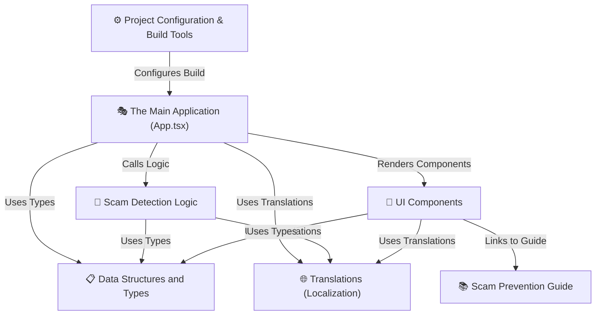

# 🛡️ ScamGuard AI - Multilingual Scam Detection System

ScamGuard AI is a comprehensive web application designed to protect users from online scams by analyzing suspicious URLs and text messages. With support for multiple languages and AI-powered detection capabilities, it provides real-time analysis with detailed explanations and confidence scores.

## ✨ Features

### 🔍 **Intelligent Analysis**
- **URL Analysis**: Detects phishing websites, domain spoofing, and suspicious links
- **Message Analysis**: Identifies scam patterns in text messages and emails
- **AI-Powered Detection**: Integrates with Hugging Face models for advanced analysis
- **Pattern Matching**: Uses comprehensive databases of known scam indicators

### 🌍 **Multilingual Support**
- **3 Languages**: English, Spanish (Español), French (Français)
- **Localized UI**: Complete interface translation
- **Multilingual Analysis**: Scam detection in multiple languages
- **Localized Explanations**: Analysis results in user's preferred language

### 📊 **Detailed Results**
- **Risk Assessment**: Safe, Suspicious, or Scam classification
- **Confidence Scores**: Percentage-based confidence levels
- **Detailed Explanations**: Clear reasoning behind each analysis
- **Analysis History**: Track recent scans and results

### 🎯 **User Experience**
- **Intuitive Interface**: Clean, modern design with dark/light themes
- **Voice Synthesis**: Text-to-speech for analysis results
- **Real-time Analysis**: Instant feedback on submitted content
- **Educational Resources**: Comprehensive scam prevention guide

## 🏗️ Architecture Overview


## 🚀 Quick Start

### Prerequisites

- **Node.js** (v16 or higher)
- **npm** or **yarn**

### Installation

```bash
# Clone the repository
git clone https://github.com/yourusername/scam-guard-multilingual.git

# Navigate to project directory
cd scam-guard-multilingual

# Install dependencies
npm install

# Start development server
npm run dev
```

### Available Scripts

| Command | Description |
|---------|-------------|
| `npm run dev` | 🚀 Start development server |
| `npm run build` | 📦 Build for production |
| `npm run lint` | 🔍 Run ESLint code analysis |
| `npm run preview` | 👀 Preview production build |

## 🔧 Tech Stack

### **Frontend Framework**
- **React 18.3.1** - Modern UI library with hooks
- **TypeScript 5.5.3** - Type-safe JavaScript
- **Vite 6.3.5** - Fast build tool and dev server

### **Styling**
- **Tailwind CSS 3.4.1** - Utility-first CSS framework
- **PostCSS** - CSS processing and optimization
- **Responsive Design** - Mobile-first approach

### **AI & Machine Learning**
- **Hugging Face Inference** - AI model integration
- **Pattern Recognition** - Custom scam detection algorithms
- **Natural Language Processing** - Text analysis capabilities

### **Development Tools**
- **ESLint** - Code quality and consistency
- **TypeScript ESLint** - TypeScript-specific linting
- **React Hooks ESLint** - React best practices

## 📁 Project Structure

```
src/
├── 📱 App.tsx                 # Main application component
├── 🎨 components/             # Reusable UI components
│   ├── Header.tsx            # App header with theme toggle
│   ├── LanguageToggle.tsx    # Language switcher
│   ├── AnalysisCard.tsx      # Input analysis containers
│   ├── RiskMeter.tsx         # Risk visualization
│   └── StatsPanel.tsx        # Analysis statistics
├── 🧠 services/              # Core business logic
│   └── scamDetection.ts      # Scam detection algorithms
├── 📋 types/                 # TypeScript type definitions
│   └── index.ts              # Shared interfaces and types
├── 🌐 utils/                 # Utility functions
│   └── translations.ts       # Localization data
├── 📚 facts.md               # Scam prevention guide
└── 🎨 styles/                # Global styles and CSS
```

## 🛡️ Core Components

### **1. Main Application (App.tsx)**
- **State Management**: Handles language, theme, and analysis states
- **Event Coordination**: Manages user interactions and component communication
- **Data Flow**: Orchestrates information between components

### **2. Scam Detection Logic**
- **Pattern Matching**: Checks against known scam indicators
- **Domain Analysis**: Validates URLs against blacklists and safelists
- **AI Integration**: Leverages external AI models for advanced detection
- **Risk Calculation**: Combines multiple factors for final assessment

### **3. UI Components**
- **Modular Design**: Reusable, self-contained components
- **Props-based**: Data flows down through component hierarchy
- **Responsive**: Adapts to different screen sizes
- **Themed**: Supports dark and light modes

### **4. Type System**
- **Type Safety**: Prevents runtime errors with compile-time checks
- **Interface Definitions**: Clear contracts for data structures
- **Generic Types**: Flexible, reusable type definitions

## 🌐 Multilingual Support

### Supported Languages

| Language | Code | Status |
|----------|------|--------|
| 🇺🇸 English | `en` | ✅ Complete |
| 🇪🇸 Spanish | `es` | ✅ Complete |
| 🇫🇷 French | `fr` | ✅ Complete |

### Translation Structure

```typescript
// Translation keys example
interface Translation {
  title: string;
  subtitle: string;
  urlAnalysis: string;
  messageAnalysis: string;
  analyzeUrl: string;
  analyzeMessage: string;
  recentAnalyses: string;
  // ... 50+ more keys
}
```

## 🔍 Detection Capabilities

### **URL Analysis**
- ✅ **Domain Spoofing**: Detects homoglyph attacks and typosquatting
- ✅ **Phishing Sites**: Identifies known malicious domains
- ✅ **Suspicious Patterns**: Analyzes URL structure and parameters
- ✅ **Blacklist Checking**: Cross-references with threat databases

### **Message Analysis**
- ✅ **Scam Phrases**: Identifies common fraud indicators
- ✅ **Language Detection**: Processes text in multiple languages
- ✅ **Context Analysis**: AI-powered content evaluation
- ✅ **Risk Scoring**: Confidence-based assessment

### **Risk Categories**

| Risk Level | Description | Confidence Range |
|------------|-------------|------------------|
| 🟢 **Safe** | Low risk, likely legitimate | 0-30% |
| 🟡 **Suspicious** | Potential risk, exercise caution | 31-70% |
| 🔴 **Scam** | High risk, likely malicious | 71-100% |

## 📊 Example Analysis Results

```json
{
  "id": "analysis_12345",
  "type": "URL Analysis",
  "content": "https://paypaI.com/secure-login",
  "risk": "Scam",
  "confidence": 95,
  "explanation": "Domain uses homoglyph attack (PaypaI vs PayPal)",
  "timestamp": "2025-06-11T15:44:00Z",
  "language": "en"
}
```

## 🎨 UI Features

### **Interactive Components**
- **Analysis Cards**: Dedicated sections for URL and message input
- **Risk Meters**: Visual representation of threat levels
- **Language Toggle**: Seamless language switching
- **Theme Toggle**: Dark/light mode support
- **Audio Playback**: Text-to-speech for accessibility

### **Responsive Design**
- 📱 **Mobile-First**: Optimized for all devices
- 🖥️ **Desktop Enhanced**: Rich features on larger screens
- ⚡ **Fast Loading**: Optimized assets and code splitting

## 🛠️ Configuration Files

| File | Purpose |
|------|---------|
| `package.json` | Dependencies and scripts |
| `vite.config.ts` | Build tool configuration |
| `tsconfig.app.json` | TypeScript compiler settings |
| `tailwind.config.js` | CSS framework configuration |
| `eslint.config.js` | Code quality rules |
| `postcss.config.js` | CSS processing pipeline |

## 🔐 Security Features

- **No Data Storage**: Analysis happens locally or via secure APIs
- **Privacy-First**: No tracking or personal data collection
- **Secure Requests**: HTTPS-only external API calls
- **Input Validation**: Sanitized user inputs

## 📚 Educational Resources

The application includes a comprehensive **Scam Prevention Guide** (`facts.md`) covering:

- 🎯 **Common Scam Types**: Lottery, job, banking scams
- 🔍 **Red Flags**: Warning signs to watch for
- 🛡️ **Protection Strategies**: Best practices for staying safe
- 📞 **Reporting**: How to report suspected scams
- ✅ **Quick Reference**: Handy checklist for users

## 🤝 Contributing

We welcome contributions! Please see our contributing guidelines:

1. **Fork** the repository
2. **Create** a feature branch
3. **Make** your changes
4. **Add** tests if applicable
5. **Submit** a pull request

### Development Workflow

```bash
# Create feature branch
git checkout -b feature/amazing-feature

# Make changes and commit
git commit -m "Add amazing feature"

# Push to branch
git push origin feature/amazing-feature

# Create Pull Request
```

## 📄 License

This project is licensed under the **MIT License** - see the [LICENSE](LICENSE) file for details.

## 🙏 Acknowledgments

- **Hugging Face** - AI model infrastructure
- **React Team** - Amazing frontend framework
- **Tailwind CSS** - Beautiful utility-first CSS
- **TypeScript Team** - Type-safe JavaScript development
- **Vite Team** - Lightning-fast build tooling

## 📞 Support

- 📧 **Email**: [architchoudhury10@gmail.com](mail:architchoudhury10@gmail.com)


**Made with ❤️ for a safer internet**

 [🐛 Report Bug](https://github.com/yourusername/scam-guard-multilingual/issues) | [✨ Request Feature](https://github.com/yourusername/scam-guard-multilingual/issues)


